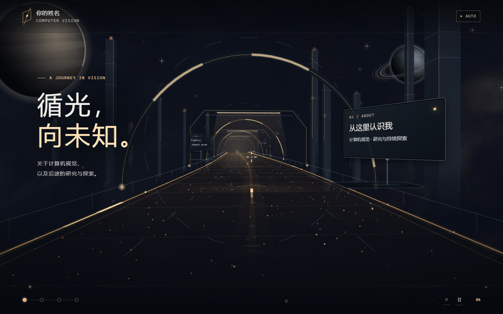

# 探索之路 · 科幻道路简历

一份沿着光与粒子之路前进的交互式个人简历：滚动前进，鼠标即视角，屏幕中心的十字准心对准路边显示器时，屏幕会在原位转向你并展开内容。背景是一张随视角和道路转动的 360° 全景星空。



## 在线查看

在线访问：<https://lipinzhe.github.io/starway/>

本地查看：直接双击 `index.html` 即可（不需要安装依赖、服务器或 API）。

单文件版：[`starway-standalone.html`](starway-standalone.html) 把整个网站（样式、脚本和星空贴图）打包进一个文件，不联网也能看。在 GitHub 上打开这个文件，点「Download raw file」下载，双击就能在浏览器里打开；也可以在线预览：<https://lipinzhe.github.io/starway/starway-standalone.html>。修改网站后，运行 `node tools/build-single.cjs` 重新生成。

## 操作

| 操作 | 效果 |
| --- | --- |
| 滚轮 / 上下滑动 | 沿道路前进、后退 |
| 移动鼠标 | 转头与抬头 / 低头，屏幕中心为十字准心 |
| 准心对准路牌 | 路牌屏幕原位转向并展开；对准链接时单击打开 |
| `AUTO` / 空格 | 自动前进 |
| ← / → | 转头；`Tab` 依次对准各块路牌；`Home` / `End` 回到入口 / 前往终点 |

更完整的说明见 [使用说明.md](使用说明.md)。

## 技术要点

- 纯静态页面：HTML + CSS + 原生 JavaScript，没有任何第三方库或外部请求。
- 全景星空：程序化生成的等距柱状贴图（内嵌为 data URI），WebGL 按道路镜头的同一投影逐像素映射；不支持 WebGL 时自动退回 2D 绘制。
- 道路与光效：Canvas 2D 绘制，线条统一使用单设备像素细线或世界坐标中的填充条带，光晕使用预渲染贴图。
- 流畅度：按屏幕刷新率均匀出帧（高刷屏自动分档），画布分辨率随设备性能自适应，静止时降低帧率减少发热；全景图在后台线程解码。
- 规范：按 web.dev、WCAG 2.2 与 NN/g 检查过。线上 Lighthouse 手机性能 78–95、桌面 92–98，无障碍、最佳实践、SEO 均为 100。
- 路边显示器是真实 DOM 元素，通过 `matrix3d` 投影到道路世界坐标中，文字清晰、可被键盘访问。
- 特效：开场跃迁与道路“通电”；快速前进时的超空间（视野外扩、星光拉丝、星云径向拖影）；流动星云与光回波；流星；路牌显像管开机与标题解码；准心锁定。全部遵循系统的“减少动态效果”设置。

## 目录

```
index.html              页面结构与路牌内容
assets/journey.js       输入、镜头、自动前进、帧节拍
assets/road-scene.js    道路、门架、光效、镜头投影
assets/sky-panorama.js  全景星空（WebGL）、星星、行星与流星
assets/effects.js       标题与路牌的文字解码效果
assets/monitors.js      路边显示器的固定底座、转动与展开
assets/*.css            样式
previews/               预览截图
starway-standalone.html 单文件版（由 tools/build-single.cjs 生成）
tools/build-single.cjs  生成单文件版
```

姓名、单位与联系方式仍为占位内容，补充后即可替换 `index.html` 中对应文字。
